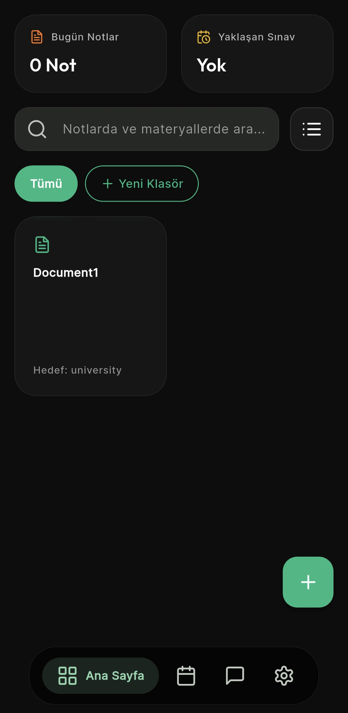
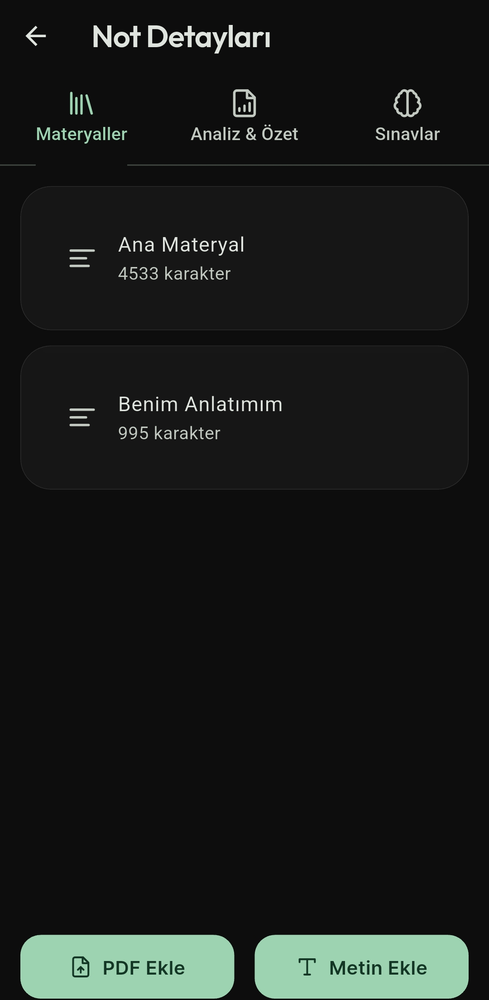
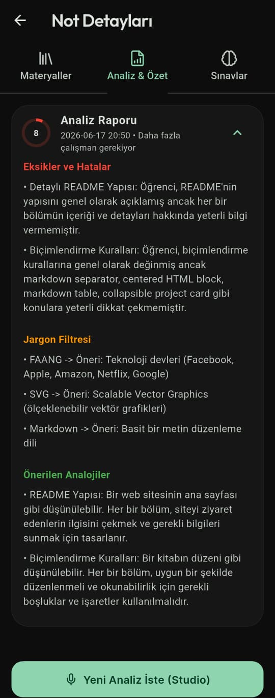
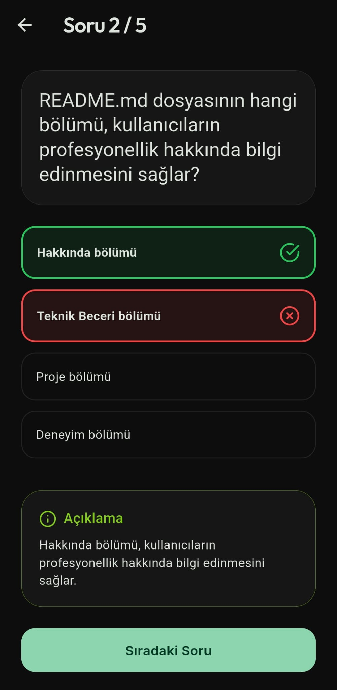
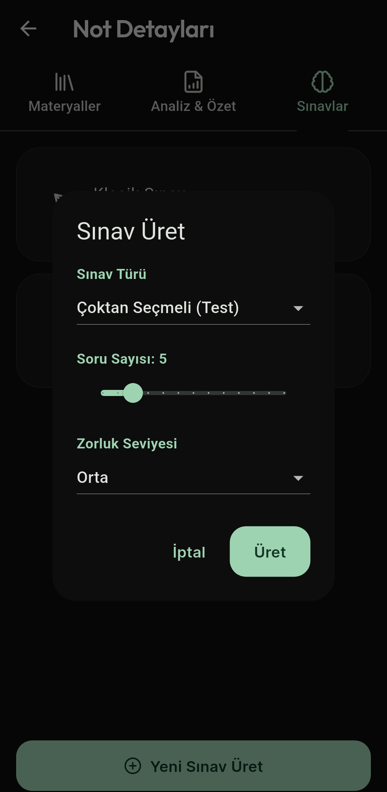
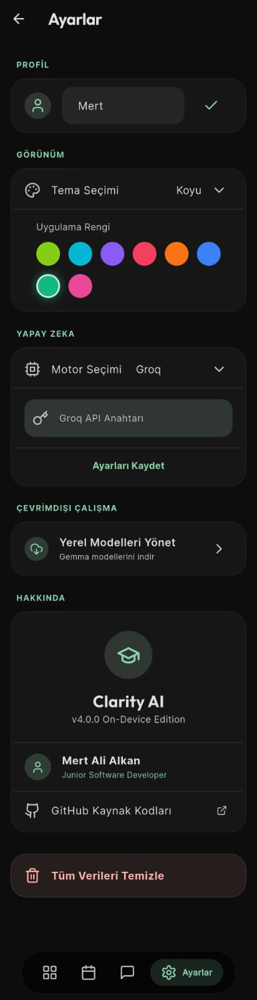

<div align="center">
  
  <h1>Clarity AI 🧠✨</h1>
  <p><strong>Yapay Zeka Destekli, Otonom Öğrenim ve Kişisel Çalışma Asistanı</strong></p>
</div>

<p align="center">
  <a href="#-neler-yapabilir">Özellikler</a> •
  <a href="#-ekran-görüntüleri">Ekran Görüntüleri</a> •
  <a href="#-yapay-zeka-motorları">AI Motorları</a> •
  <a href="#-teknik-altyapı">Teknik Altyapı</a> •
  <a href="#-kurulum">Kurulum</a>
</p>

---

**Clarity AI**, standart bir not alma uygulamasını **Yapay Zeka (AI)** gücüyle birleştirerek kişisel bir öğretmene, sınav hazırlayıcıya ve analiste dönüştüren çapraz platformlu bir mobil uygulamadır. Girdiğiniz metinlerden veya PDF dosyalarından, sizin için anında testler üretir, flashcard'lar (hafıza kartları) hazırlar ve konuyu ne kadar iyi anladığınıza dair size bir karnesi çıkarır. 

Material You 3 (Dinamik Tasarım) konsepti kullanılarak tasarlanmıştır.

---

## 🎯 Feynman Tekniği ile Öğrenim

Clarity AI'ın kalbinde dünyaca ünlü **Feynman Öğrenme Tekniği** yatar. Uygulamanın tüm analiz altyapısı bu 4 adıma göre kurgulanmıştır:

1. **Konuyu Basitçe Anlat (Hedef Kitle):** Öğrendiğiniz konuyu "5 yaşında bir çocuğa" veya "hiç bilmeyen birine" anlatıyormuş gibi not alırsınız (veya sesle anlatırsınız).
2. **Boşlukları Tespit Et (Gaps):** AI, yazdıklarınızı referans materyalle (PDF) kıyaslar ve anladığınızı sandığınız ama aslında eksik bildiğiniz *"Bilgi Boşluklarını"* yakalar.
3. **Karmaşık Terimleri Ayıkla (Jargon Filtresi):** Kullandığınız ağır ve ezbere dayalı teknik kelimeleri (jargonları) tespit eder ve onları basitleştirmeniz için sizi uyarır.
4. **Basitleştir ve Benzet (Analoji):** Konuyu zihninizde tam oturtmak için gerçek hayattan kusursuz analojiler (benzetmeler) üreterek konunun mantığını kavramanıza yardımcı olur.

---

## 🔥 Neler Yapabilir? (Ana Modüller)

### 1. 📚 Not ve Materyal Yönetimi (Studio)
* **Manuel Giriş & PDF Tarama:** Dilerseniz el yazısı / klavye notlarınızı girebilir, dilerseniz cihazınızdaki bir PDF belgesini (örneğin ders slaytı veya e-kitap) doğrudan uygulamaya aktarabilirsiniz.
* **Hedef Kitle (Target Audience) Uyarlaması:** "Bunu bana 5 yaşındaki bir çocuğa anlatır gibi anlat" veya "Üniversite seviyesinde akademik bir dille açıkla" gibi komutlarla, AI'ın yüklediğiniz materyali kendi seviyenize göre yeniden yapılandırmasını sağlayabilirsiniz.
* **Klasörleme ve Öncelik:** Notlarınızı klasörlere ayırarak ve yıldız/öncelik atayarak düzenli tutabilirsiniz.

### 2. 📊 Detaylı Öğrenim Raporları (AI Reports)
* Bir not oluşturduğunuzda AI, bu notu analiz ederek size **%0-100 arası bir Skor Ringi** çıkartır.
* **Eksiklikler (Gaps):** Notta değinmeyi unuttuğunuz ancak konunun bütünü için önemli olan kritik detayları size söyler.
* **Jargon Çevirmeni:** Kullandığınız ağır sektörel kelimeleri (jargon) tespit edip, yanlarına herkesin anlayabileceği basit karşılıklarını yazar.
* **Analoji (Benzetme) Motoru:** Öğrenmesi zor soyut kavramları, gerçek hayattan basit örneklerle eşleştirerek aklınızda kalmasını sağlar. *(Örn: Mitokondriyi bir şehrin enerji santraline benzetmek)*.
* Eski raporlarınız silinmez; **Geçmiş Raporlar** sekmesi altında akordeon (ExpansionTile) listesinde tarih sırasına göre arşivlenir.

### 3. 🧠 Dinamik Sınav Motoru (Quizzes & Flashcards)
Çalıştığınız notlardan anında sınava girebilirsiniz! Üstelik **Soru Sayısını (3-15)** ve **Zorluk Seviyesini (Kolay, Orta, Zor, Uzman)** kendiniz belirlersiniz.
1. **Test Modu:** 4 şıklı çoktan seçmeli, gerçek bir sınav simülasyonu.
2. **Flashcard (Hafıza Kartları):** Tıkladığınızda dönen interaktif çalışma kartları. Hızlı ezber ve tekrarlar için idealdir.
3. **Klasik (Açık Uçlu) Mod:** Size bir soru sorulur, cevabı dilediğiniz gibi metin olarak yazarsınız. Gönderdiğinizde sistem size "Bulunması Gereken Anahtar Kelimeler"i ve "Örnek Çözümü" sunarak, kendi kendinizi puanlamanızı ister.

### 4. 💬 Bağlam Farkındalı AI Sohbet (Context-Aware Chat)
* **Global ve Not İçi Sohbet:** Uygulama genelinde veya sadece tek bir nota özel sohbet başlatabilirsiniz. 
* Asistan, sisteme yüklediğiniz **PDF'lerin ve notların tamamını** hafızasında tutar. *"Bugün yüklediğim hücre bölünmesi PDF'indeki 3. konuyu açıklar mısın?"* dediğinizde, PDF'in içinden okuduğu verilerle size cevap üretir.
* Tüm geçmiş sohbetleriniz (Chat Sessions) kaydedilir, daha sonra kaldığınız yerden devam edebilirsiniz.

### 5. 🎨 Material You 3 ve Özelleştirme
* **Dinamik Vurgu Rengini Değiştirme:** Ayarlar sayfasında 10+ farklı renk paletinden kendi temanızı yaratabilirsiniz.
* Gece / Gündüz teması arasında pürüzsüz geçiş (Smooth Transition).
* Glassmorphism (Buzlu cam / Bulanık arka plan) efektli zarif UI elemanları.

---

## 📸 Ekran Görüntüleri


<table>
  <tr>
    <td align="center"><b>Ana Sayfa (Dashboard)</b><br>Son notlar, klasörler ve global istatistikler.</td>
    <td align="center"><b>Not Detayı (Material View)</b><br>Tüm PDF okumaları, metinler ve AI Raporunun bulunduğu panel.</td>
    <td align="center"><b>Analiz ve Rapor (Score Ring)</b><br>Not üzerinden alınan 100 üzerinden skor ve eksiklik tespitleri.</td>
  </tr>
  <tr>
    <td></td>
    <td></td>
    <td></td>
  </tr>
  <tr>
    <td align="center"><b>Test Sınav Modu</b><br>Kullanıcının metin girdiği, açık uçlu sınav arayüzü.</td>
    <td align="center"><b>Test Sınav Modu</b><br>Yapay zeka tarafından oluşturulan, 4 şıklı çoktan seçmeli sınav arayüzü.</td>
    <td align="center"><b>Ayarlar ve AI Seçimi</b><br>Model, API key ve tema değiştirme ekranı.</td>
  </tr>
  <tr>
    <td></td>
    <td></td>
    <td></td>
  </tr>
</table>

---

## 🤖 Yapay Zeka Motorları (Özgür Seçim)

Bizi rakiplerimizden ayıran en büyük özellik, sizi tek bir AI firmasına mecbur bırakmamamızdır. Ayarlar menüsünden saniyeler içinde zekayı değiştirebilirsiniz:

1. **Google Gemini:** Hızlı ve yüksek içerikli analizler için idealdir.
2. **OpenAI (ChatGPT):** Gelişmiş akıl yürütme, doğal dil ve sınav üretimleri için.
3. **Groq:** Llama 3 destekli, ışık hızında token üretimi (Ultra hızlı yanıt).
4. **Local Device (Cihaz İçi - İnternetsiz):** `flutter_gemma` kütüphanesi entegrasyonu sayesinde Gemma-IT modelini doğrudan cihazınıza indirip (Offline), hiçbir verinizi dış sunuculara göndermeden %100 gizlilikle çalıştırabilirsiniz.
5. **Özel Sunucu (Custom/Ollama):** Kendi yerel bilgisayarınızda bir yapay zeka barındırıyorsanız (Ollama), doğrudan local IP adresinizi ve model isminizi girerek asistanınızı kendiniz besleyebilirsiniz.

---

## 🛠 Teknik Altyapı

* **Framework:** Flutter (Dart)
* **Gelişmiş State Management:** Riverpod (`StateNotifierProvider` ile reaktif UI yapıları)
* **Veritabanı:** sqflite (Tamamen yerel cihazda saklanan şifreli depolama, sunucu masrafı sıfır!)
* **Routing:** go_router (Deep linking ve pürüzsüz ekran geçişleri)
* **Güvenlik:** flutter_secure_storage (Kullanıcıya ait API anahtarlarının cihazın anahtarlık/keystore alanında donanımsal olarak şifrelenmesi)
* **PDF Motoru:** syncfusion_flutter_pdf (Çok sayfalı metinleri kusursuz okuma)
* **R8 Minifier İstisnası:** MediaPipe bağımlılıklarının çökmemesi için özel Proguard Kuralları eklendi.

---

## 📦 Kurulum ve Çalıştırma

1. Bilgisayarınızda [Flutter SDK](https://docs.flutter.dev/get-started/install)'nın kurulu (tercihen v3.19+) olduğundan emin olun.
2. Repoyu bilgisayarınıza kopyalayın:
   ```bash
   git clone https://github.com/kullaniciadi/clarity_ai.git
   ```
3. Klasöre girip paketleri yükleyin:
   ```bash
   cd clarity_ai
   flutter pub get
   ```
4. Uygulamayı başlatın:
   ```bash
   flutter run
   ```
5. *(Eğer Google Play için sürüm çıktısı alacaksanız `flutter build appbundle --release`, standart kurulum paketi için `flutter build apk --release` komutunu kullanabilirsiniz.)*

---

<div align="center">
  <sub>Mert Ali tarafından Flutter & ♥ ile geliştirilmiştir.</sub>
</div>
